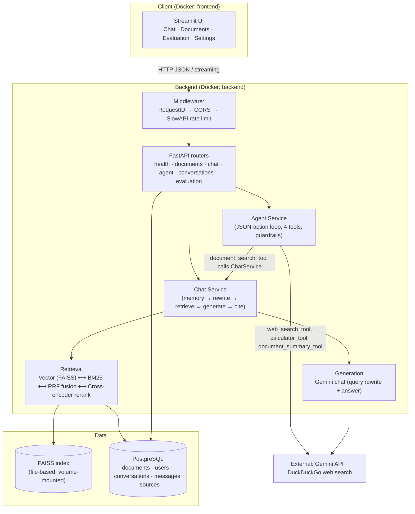
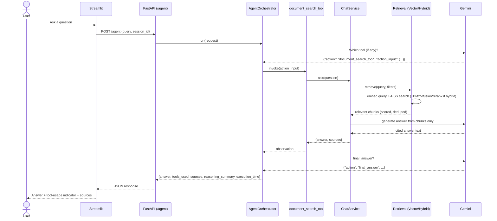

# Agentic RAG Research Assistant

A portfolio-grade, production-style **Agentic RAG** system: an LLM-based agent (Gemini)
that routes between document retrieval, web search and a calculator tool,
built on top of an advanced RAG pipeline (hybrid retrieval, reranking, query
rewriting, citations) with conversational memory and automated evaluation.

This repository is built **incrementally, milestone by milestone**. This
README reflects the current milestone and will be updated as each new one
lands.

> **Current milestone: 6 — Productionization.**
> Docker + docker-compose (backend, frontend, PostgreSQL), structured
> logging with per-request IDs, slowapi rate limiting, upload
> validation, an enhanced DB-aware health check, Alembic migrations,
> and a multi-page Streamlit UI (Chat, Documents, Evaluation,
> Settings). See [§12](#12-milestone-5--conversational-memory) and
> [§13](#13-milestone-6--productionization).

---

## 1. Target architecture

### Request flow (full target — not all boxes exist yet)

```
                         ┌──────────────────┐
                         │    Streamlit      │
                         │    Frontend       │
                         └────────┬──────────┘
                                  │ HTTP (JSON)
                                  ▼
                         ┌──────────────────┐
                         │     FastAPI       │
                         │     Backend       │
                         └────────┬──────────┘
                                  │
                                  ▼
                       ┌─────────────────────┐
                       │   Agent / Router    │   ← implemented (app/agents, JSON-action loop)
                       │      (Gemini)       │
                       └──────────┬──────────┘
                                  │
        ┌────────────┬────────────┼────────────┬────────────┐
        ▼            ▼            ▼            ▼            │
  Document RAG   Web Search   Calculator  Doc Summary   (all 4 tools implemented)
             │
             ▼
      Query Rewriting                                              ← implemented
             │
             ▼
       Hybrid Retrieval                                             ← implemented (RETRIEVAL_MODE=hybrid;
       ┌──────────────┐                                               RETRIEVAL_MODE=vector keeps M2's path)
       │ Vector Search│  ← implemented
       │ BM25 Search  │  ← implemented (rank_bm25, fused via RRF)
       └──────┬───────┘
              ▼
          Reranker                                                  ← implemented (local cross-encoder,
              │                                                        RERANKER_BACKEND=cross_encoder|none)
              ▼
       Relevant Chunks                                               ← implemented (dedup)
              │
              ▼
          LLM (Gemini)                                                  ← implemented
              │
       ┌──────┴───────┐
       ▼              ▼
   Answer         Citations                                          ← both implemented
```

### This milestone's request lifecycle — **implemented**

```
User Query
   │
   ▼
Memory ──────────────► bounded window of prior messages (SQL, not the full transcript)
   │
   ▼
Query Rewrite ───────► LLM folds conversational context into one standalone,
   │                   retrieval-optimized query (skipped on a conversation's first turn)
   ▼
Retrieval ───────────► embed the rewritten query, semantic search (optionally
   │                   restricted to one document / one document type)
   ▼
Context Selection ───► drop near-duplicate chunks, keep top_k by score,
   │                   discard anything below the relevance floor
   ▼
LLM ─────────────────► generate an answer using ONLY the selected chunks
   │                   (streamed token-by-token), or skip straight to a fixed
   │                   "cannot determine this" answer if nothing cleared the bar
   ▼
Citation ────────────► parse [n] markers out of the answer text, map back to
   │                   (document name, page number, chunk id)
   ▼
Response ────────────► {answer, sources, retrieved_chunks, confidence,
                        rewritten_query, session_id}
```

See [§3](#3-request-lifecycle-explained) for a step-by-step walkthrough of
exactly which module does what.

### This milestone's addition: hybrid retrieval (`RETRIEVAL_MODE=hybrid`)

```
                    User Query (rewritten)
                          │
             ┌────────────┴────────────┐
             ▼                         ▼
       Vector Search              Keyword Search
      (VectorRetriever,            (BM25Retriever,
       FAISS, top vector_top_k)     rank_bm25, top bm25_top_k)
             │                         │
             └────────────┬────────────┘
                          ▼
                  Result Fusion (RRF)
              Reciprocal Rank Fusion — combines
              rank position, not raw scores (vector
              cosine and BM25 scores aren't comparable)
                          │
                          ▼  top rerank_top_k
                      Reranker
              cross-encoder scores (query, chunk) jointly
              (CrossEncoderReranker | NoOpReranker)
                          │
                          ▼
              Dedup + top final_context_k
                          │
                          ▼
                         LLM
```

`RETRIEVAL_MODE=vector` (the default) skips all of this and uses the
unchanged Milestone 2 `RetrievalService` — see [§10](#10-hybrid-retrieval-explained)
for why each stage exists and when it actually helps.

### This milestone's addition: the agent loop (`POST /api/v1/agent`)

```
User
 │
 ▼
Agent ─────────────► LLM decides ONE action per turn: call a tool, or
 │                    give a final_answer — never both, never blindly
 ▼
Tool Selection ────► parsed from the model's JSON response
 │                    (app.agents.parsing.parse_agent_action)
 ▼
Tools ─────────────► document_search_tool | web_search_tool |
 │                    calculator_tool | document_summary_tool
 ▼
Observation ───────► the tool's output (or a caught error/timeout) is
 │                    appended to the conversation and fed back in
 ▼
 ... repeats (max agent_max_iterations turns) ...
 │
 ▼
Final Answer ──────► {answer, tools_used, sources, reasoning_summary,
                       execution_time} — see §11 for the full explanation
                       and 10 worked example queries.
```

This is a separate service from the plain chat pipeline
(`app.services.agent_service`, not `chat_service`) — `document_search_tool`
*calls* `ChatService` for its RAG work rather than reimplementing it, so the
agent always benefits from whatever retrieval mode/settings are configured.

### What exists today (Milestone 0 + 1 + 2 + 3 + 4)

```
Streamlit  →  FastAPI  →  /api/v1/health
                       →  /api/v1/documents/{upload,list,get,delete,reindex,chunks,stats}
                       →  /api/v1/chat, /api/v1/chat/stream
                       →  /api/v1/agent  ──►  AgentService → AgentOrchestrator → 4 tools
                              │              (app/agents, app/services/agent_service.py —
                              │               document_search_tool calls ChatService below)
                 ┌────────────┴─────────────┐
                 ▼                          ▼
         DocumentService              ChatService ──── picks retrieval_mode:
      (ingestion orchestration)   (conversational RAG orchestration)  │
                 │                          │                         │
                 ▼                    ┌─────┴──────┐          ┌──────┴───────┐
        IngestionPipeline             ▼            ▼          ▼              ▼
       (app/rag/ingestion)   QueryRewriter / AnswerGenerator  RetrievalService  HybridRetrievalService
                 │           (app/rag/generation)             (vector-only,     (vector+BM25+RRF+
                 │                  │                          app/services)     rerank, app/services)
                 │                  │                          │                 │
                 │                  │                          └────────┬────────┘
                 │                  │                                   ▼
                 │                  │                       BM25Retriever + fusion.py + BaseReranker
                 │                  │                       (app/rag/retrieval, app/rag/reranking)
                 └──────────┬───────┘                                   │
                            ▼                                           │
              Gemini embeddings ◄──────── shared ────────────────────────
              (app/rag/embeddings)              Gemini chat completions
                            │
                            ▼
                  FAISS vector store
                (app/rag/vectorstore)
                            │
                            ▼
              SQL metadata store (documents, chunks, conversations, messages)
                      (app/database — SQLite by default)
```

Only the rest of the evaluation harness (answer correctness/faithfulness,
beyond the retrieval benchmark Milestone 3 added) is still an empty
placeholder package. This keeps the codebase honest: imports don't lie
about what's implemented.

---

## 2. Directory structure and responsibilities

```
RAG/
├── app/
│   ├── main.py                  # App factory: config/logging/DB-init/routes. No business logic.
│   ├── api/
│   │   ├── deps.py              #   shared FastAPI dependency providers (settings, db session)
│   │   └── v1/
│   │       ├── router.py        #   aggregates all v1 endpoint routers
│   │       └── endpoints/
│   │           ├── health.py    #   GET /health
│   │           ├── documents.py #   document upload/list/get/delete/reindex/chunks/stats
│   │           ├── chat.py      #   POST /chat, POST /chat/stream
│   │           ├── agent.py     #   POST /agent
│   │           ├── conversations.py  # conversation create/list/get/delete (Milestone 5)
│   │           └── evaluation.py     # POST /evaluation/benchmark (Milestone 6)
│   ├── core/
│   │   ├── config.py            #   Settings: app, DB, chunking, retrieval, rate limits, logging (Milestone 6)
│   │   ├── logging.py           #   logging.dictConfig — text or JSON formatter, request-id filter
│   │   ├── request_id.py        #   X-Request-ID middleware + contextvar + logging filter (Milestone 6)
│   │   ├── rate_limit.py        #   shared slowapi Limiter instance (Milestone 6)
│   │   └── exceptions.py        #   AppException hierarchy + FastAPI error handlers
│   ├── models/                  # Pydantic schemas (API contracts), not ORM models
│   │   ├── schemas.py           #   HealthResponse (now includes DB connectivity)
│   │   ├── document.py          #   Document/Chunk/Stats request-response schemas
│   │   ├── chat.py              #   ChatRequest/ChatResponse/SourceCitation/ChatStreamMeta
│   │   ├── agent.py             #   AgentRequest/AgentResponse/ToolSourceOut
│   │   └── conversation.py      #   ConversationSummary/Detail, MessageOut, MessageSourceOut (Milestone 5)
│   ├── services/
│   │   ├── document_service.py  #   Orchestrates rag/ingestion + database for documents
│   │   ├── chunk_lookup.py      #   Shared SQL helpers (RetrievedChunk, filters) — both retrieval services use this
│   │   ├── retrieval_service.py #   Vector-only retrieval (Milestone 2, unchanged)
│   │   ├── hybrid_retrieval_service.py  # Vector + BM25 + RRF fusion + rerank (Milestone 3)
│   │   ├── chat_service.py      #   The conversational RAG orchestrator (memory→...→response); persists titles + sources (Milestone 5)
│   │   ├── agent_service.py     #   Builds the 4 tools per-request, runs AgentOrchestrator (Milestone 4)
│   │   └── conversation_service.py  # Conversation CRUD + default-user provisioning (Milestone 5)
│   ├── rag/                     # RAG pipeline — pure logic, no DB/HTTP
│   │   ├── ingestion/           #   extraction, cleaning, chunking, hashing (Milestone 1)
│   │   ├── embeddings/          #   BaseEmbedder interface + Gemini implementation
│   │   ├── vectorstore/         #   VectorStore interface + FAISS implementation + factory
│   │   ├── retrieval/
│   │   │   ├── vector_retriever.py  # pure: embed query -> vector_store.search(allowed_ids)
│   │   │   ├── bm25_retriever.py    # pure: rank_bm25 over a caller-supplied (id, text) corpus
│   │   │   ├── fusion.py            # Reciprocal Rank Fusion
│   │   │   └── dedup.py             # near-duplicate chunk-text detection (shared by both services)
│   │   ├── reranking/
│   │   │   ├── base.py              # BaseReranker interface
│   │   │   ├── cross_encoder_reranker.py  # sentence-transformers cross-encoder (the default)
│   │   │   └── noop_reranker.py     # passthrough (RERANKER_BACKEND=none)
│   │   ├── generation/
│   │   │   ├── base.py          #   BaseChatModel interface + gemini_chat_model.py implementation
│   │   │   ├── prompts.py       #   every system/user prompt template, in one auditable file
│   │   │   ├── query_rewriter.py    # LLM call #1: conversation -> standalone query
│   │   │   └── answer_generator.py  # LLM call #2: query+chunks -> cited answer (streamable)
│   │   └── dependencies.py      #   cached singletons (embedder, vector store, reranker, rewriter, generator)
│   ├── agents/                  # Milestone 4: the agent loop
│   │   ├── tools/                #  document_search (calls ChatService), web_search (ddgs, free),
│   │   │                         #  calculator (safe AST eval, no eval()), document_summary
│   │   ├── prompts.py            #  agent system prompt (JSON-action protocol)
│   │   ├── parsing.py            #  parses the action JSON; builds the safe reasoning_summary
│   │   └── orchestrator.py       #  the loop: max iterations, per-tool timeout, fallback
│   ├── evaluation/
│   │   ├── dataset.py           #   14-passage corpus + 22 question/relevant-id pairs
│   │   ├── metrics.py           #   Recall@k, MRR (pure functions)
│   │   └── retrieval_benchmark.py  # vector-only vs BM25-only vs hybrid vs hybrid+rerank, measured
│   ├── database/
│   │   ├── session.py           #   SQLAlchemy engine/session + init_db() (Alembic-owned in production, Milestone 6)
│   │   └── models.py            #   DocumentRecord, ChunkRecord, UserRecord, ConversationRecord, MessageRecord, MessageSourceRecord
│   └── utils/                   # small, dependency-free helpers shared across the app
├── migrations/                  # Alembic (Milestone 5) — env.py wired to Settings.database_url + Base.metadata
│   └── versions/86de312205ca_initial_schema.py
├── frontend/
│   ├── streamlit_app.py         # Chat page: mode toggle (Direct RAG stream / Agent), conversation history sidebar (Milestone 6)
│   ├── pages/
│   │   ├── 1_Documents.py       #   upload/list/preview/reindex/delete (Milestone 6 — moved out of the Chat page)
│   │   ├── 2_Evaluation.py      #   button-triggered retrieval benchmark + failed-query breakdown (Milestone 6)
│   │   └── 3_Settings.py        #   read-only backend/health/storage diagnostics (Milestone 6)
│   └── api_client.py            #   the only module allowed to call `requests` against the backend
├── tests/                       # pytest suite — see §7
├── data/, logs/                 # gitignored contents — see Milestone 1 README section
├── Dockerfile, frontend/Dockerfile, docker-compose.yml, .dockerignore   # Milestone 6
├── requirements.txt / requirements-dev.txt
├── pytest.ini / alembic.ini / .env.example / .gitignore
```

**Why this layout (additions this milestone):**

- **`rag/retrieval/` vs `services/retrieval_service.py`** — the same split as
  ingestion: `vector_retriever.py` is pure (embed + search an optional
  `allowed_ids` set, no DB), while `retrieval_service.py` is the DB-aware
  layer that turns a document/document-type filter into `allowed_ids`,
  resolves hits to chunk content, and removes near-duplicates. This is what
  makes retrieval independently testable (fake embedder + real FAISS index,
  no service layer needed) and independently swappable.
- **Metadata filtering without hybrid search** — FAISS's flat index has no
  native filtered search. `VectorStore.search()` grew an `allowed_ids`
  parameter; the FAISS implementation reconstructs and scores only the
  allowed vectors directly (`IndexIDMap2.reconstruct`), which is exact, not
  approximate, since the underlying index was already an exact flat scan.
  A future Qdrant/pgvector backend would instead pass `allowed_ids` as a
  native indexed filter — same interface, better performance, no app code
  changes.
- **"Keep retrieval, prompting and generation as separate services"** —
  `retrieval_service.py` (retrieval), `rag/generation/prompts.py` (prompting
  — every prompt template lives in one auditable file), and
  `rag/generation/answer_generator.py` (generation) are three distinct
  modules; `chat_service.py` is the only thing that sequences them.
- **Conversational memory is minimal on purpose** — `ConversationRecord` /
  `MessageRecord` exist only to give query rewriting a bounded window of
  prior turns to read (`Settings.conversation_history_window`, default 6
  messages). Full session management (titles, ownership, expiry) is
  Milestone 5's job; this is deliberately just enough to make follow-up
  questions work.
- **Citations come from parsing the answer, not JSON mode** — the model is
  asked to inline-cite with `[n]` markers instead of returning structured
  JSON. That's what makes streaming practical: the client renders raw text
  as it arrives and only needs to parse citation markers once, after the
  stream ends. See `answer_generator.extract_cited_indices`.
- **Two-phase streaming (`prepare()` then `stream_answer()`)** — query
  rewriting and retrieval (which embeds the query — a real failure point,
  e.g. a bad API key) run synchronously *before* the streaming HTTP response
  begins, so a failure there still becomes a clean JSON error. Only the
  actual answer-generation LLM call streams, which is the one place a
  "failure mid-response" is genuinely unavoidable.
- **The provider swap actually happened, not just in theory** — this project
  started on OpenAI (embeddings + chat) and was migrated to Gemini (free
  tier, no credit card) for both. `BaseEmbedder` already made the embeddings
  side a one-file swap; the chat side didn't have an equivalent interface
  yet, so `app/rag/generation/base.py` (`BaseChatModel`) was added as part of
  this migration — `query_rewriter.py`/`answer_generator.py` now depend only
  on that interface, never on a provider SDK shape. Zero changes were needed
  to `chat_service.py`, `retrieval_service.py`, prompts, or any test's
  assertions — only the provider implementation and the dependency wiring
  in `app/rag/dependencies.py` changed.
- **Hybrid retrieval is additive, not a rewrite** — `RetrievalService`
  (vector-only) is untouched; `HybridRetrievalService` is a new, separate
  class. The only shared code is `app/services/chunk_lookup.py` (SQL
  filter/lookup helpers, extracted from `RetrievalService` in a pure,
  behavior-preserving refactor — every Milestone 2 test still passes
  unchanged) and `app/rag/retrieval/dedup.py` (near-duplicate detection).
  `ChatService.prepare()` is the only place that branches on
  `Settings.retrieval_mode`.
- **Fusion uses rank, not score** — vector cosine similarity and BM25's
  score live on completely different, incomparable scales. Reciprocal
  Rank Fusion (`fusion.py`) sidesteps that by only ever looking at each
  candidate's *position* in each ranked list, never the raw number.
- **BM25's corpus is rebuilt from SQL per query, not persisted** —
  `rank_bm25` has no incremental index API (unlike FAISS), so
  `HybridRetrievalService` loads the matching `ChunkRecord` rows fresh
  each time and builds a new `BM25Okapi` index. Fine at this project's
  scale; a documented scaling limit (same honesty as FAISS's exact
  flat-index tradeoff) for a corpus large enough that this matters — a
  production system would maintain a persistent, incrementally-updated
  inverted index (Elasticsearch/OpenSearch/tantivy) instead.
- **The reranker is a real interface, not a hardcoded model** —
  `BaseReranker` has two implementations: `CrossEncoderReranker`
  (sentence-transformers, local, free, the default) and `NoOpReranker`
  (`RERANKER_BACKEND=none`, a pure passthrough that preserves fusion's
  order exactly — this is what makes reranking optional rather than
  load-bearing).
- **Every hybrid stage's output survives to the API response** —
  `RetrievalDiagnostics` (`vector_results`, `keyword_results`,
  `fused_results`, `reranked_results`) is `None` in vector-only mode and
  fully populated in hybrid mode, visible in both the JSON response and
  the Streamlit "Retrieval details" expander (one tab per stage) — built
  for exactly the kind of "why did it retrieve *that*" debugging hybrid
  pipelines otherwise make opaque.

---

## 3. Request lifecycle, explained

```
User Query → Memory → Query Rewrite → Retrieval → Context Selection → LLM → Citation → Response
```

1. **User Query** — `POST /api/v1/chat` (or `/chat/stream`) receives
   `{question, session_id?, document_id?, document_type?, top_k?}`
   (`app/models/chat.py:ChatRequest`).

2. **Memory** — `ChatService._get_or_create_conversation()` finds or creates
   a `ConversationRecord` by `session_id` (server-generated if omitted).
   `_load_history()` reads only the **last `conversation_history_window`
   messages** (default 6 = ~3 turns) — never the full transcript.

3. **Query Rewrite** — `QueryRewriter.rewrite(history, question)`
   (`app/rag/generation/query_rewriter.py`). If there's no history yet (first
   turn), it returns the question unchanged and **skips the LLM call
   entirely**. Otherwise it sends the bounded history + question to the LLM
   with a prompt that resolves pronouns/references into one standalone query
   (`"What are its disadvantages?"` → `"What are the disadvantages of
   SMOTE?"`). On any LLM failure it degrades gracefully to the original
   question rather than failing the whole request.

4. **Retrieval** — `RetrievalService.retrieve()` (`app/services/
   retrieval_service.py`):
   - resolves `document_id`/`document_type` into a set of allowed vector ids
     via SQL (or `None` = search everything);
   - embeds the rewritten query and searches FAISS, over-fetching
     `top_k * retrieval_overfetch_multiplier` candidates;
   - joins hits back to `ChunkRecord`/`DocumentRecord` for content + citation
     metadata.

5. **Context Selection** — still inside `retrieve()`: candidates are sorted
   by score, and any candidate whose text is a **near-duplicate** (>90%
   similarity, `difflib.SequenceMatcher`) of an already-kept chunk is
   dropped, before truncating to `top_k`. `ChatService` then drops anything
   below `min_relevance_score` (default 0.15 cosine similarity) — if
   *nothing* survives, generation is skipped entirely and the fixed
   "cannot determine this from the uploaded documents" answer is returned
   (hallucination prevention, layer 1 — deterministic, no LLM call spent).

6. **LLM** — `AnswerGenerator.generate()` / `.generate_stream()`
   (`app/rag/generation/answer_generator.py`) sends the query + numbered
   source excerpts (`prompts.build_answer_messages`) with instructions to
   answer only from those sources, cite every claim with `[n]`, and reply
   with the exact fixed sentence if the sources are insufficient
   (hallucination prevention, layer 2 — the model's own judgment, as a
   second line of defense).

7. **Citation** — `ChatService._finalize()` extracts cited `[n]` markers
   (`extract_cited_indices`), maps them back to the actual chunk's filename/
   page number/chunk id, and computes a heuristic `confidence` (high/medium/
   low) from the average similarity score of the *cited* chunks — not a
   calibrated metric, just a practical proxy (real faithfulness scoring is
   the Evaluation milestone).

8. **Response** — the turn (original question + final answer) is persisted
   to `MessageRecord`, and the structured payload is returned:
   ```json
   {
     "answer": "...",
     "sources": [{"index": 1, "document_name": "...", "page_number": 12, "chunk_id": "..."}],
     "retrieved_chunks": [...],
     "confidence": "high",
     "rewritten_query": "...",
     "session_id": "..."
   }
   ```
   `POST /chat/stream` sends the answer text as it's generated, then one
   final chunk: `\n<<<META>>>\n` + this same payload minus `answer` (see
   `STREAM_META_DELIMITER` in `chat_service.py`).

---

## 4. Roadmap (not yet built — do not assume these exist)

1. ~~**Document ingestion**~~ — done (Milestone 1).
2. ~~**Core retrieval + generation**~~ — done (Milestone 2).
3. ~~**Advanced retrieval**~~ — hybrid (vector + BM25) search + reranking —
   done this milestone.
4. ~~**Agent layer**~~ — LLM-based tool-selecting agent (document search,
   web search, calculator, document summary) — done this milestone.
5. ~~**Memory**~~ — full session management (titles, `User`/`MessageSource`
   tables, conversation CRUD API, Alembic migrations) — done (Milestone 5,
   see [§12](#12-milestone-5--conversational-memory)).
6. **Evaluation** — the retrieval-quality benchmark (§10) is exposed via
   `POST /api/v1/evaluation/benchmark` and the Evaluation UI page, but
   answer correctness / faithfulness scoring on *generation* (replacing
   today's heuristic confidence with something calibrated) is still not
   built — still an honestly-empty gap, not a hidden one.
7. ~~**Productionization**~~ — Docker/Compose, Alembic migrations,
   structured logging + request IDs, rate limiting, file validation,
   multi-page UI — done (Milestone 6, see
   [§13](#13-milestone-6--productionization)). CI is not set up.

---

## 5. Setup

### Quick start with Docker (backend + frontend + PostgreSQL)

```bash
cp .env.example .env    # fill in a real GEMINI_API_KEY
docker compose up --build
```

Frontend: http://localhost:8501 · Backend docs: http://localhost:8000/docs
— see [§13](#13-milestone-6--productionization) for what each service does.
Everything below this point is the **local, no-Docker** setup (SQLite,
run backend/frontend as separate processes) — still fully supported and
what the test suite uses.

### Prerequisites

- Python 3.10+
- A free Gemini API key from [Google AI Studio](https://aistudio.google.com/apikey)
  — no credit card required (embeddings + chat completions both call the
  real API). PostgreSQL is **not** required; SQLite is used by default.

### Install dependencies

```bash
python -m venv .venv
# Windows (PowerShell):
.venv\Scripts\Activate.ps1
# macOS/Linux:
source .venv/bin/activate

# sentence-transformers (the reranker) pulls in torch. Install the small
# CPU-only wheel first to avoid a multi-GB default download:
pip install torch --index-url https://download.pytorch.org/whl/cpu

pip install -r requirements-dev.txt   # runtime + test deps
```

The cross-encoder reranker model (~90MB) downloads once on first use and
is cached locally afterward — no network call on subsequent runs.

### Configure environment

```bash
cp .env.example .env    # Windows: copy .env.example .env
```

Set a real key in `.env` (get one free at https://aistudio.google.com/apikey):

```
GEMINI_API_KEY=your real key...
```

Retrieval/chat defaults worth knowing (all in `.env.example`, all overridable):
`RETRIEVAL_TOP_K=5`, `MIN_RELEVANCE_SCORE=0.15`, `DEDUP_SIMILARITY_THRESHOLD=0.9`,
`CONVERSATION_HISTORY_WINDOW=6`.

**Hybrid retrieval is off by default** (`RETRIEVAL_MODE=vector`, the
unchanged Milestone 2 path). To try it:

```
RETRIEVAL_MODE=hybrid
VECTOR_TOP_K=20            # candidates fetched from FAISS
BM25_TOP_K=20               # candidates fetched from BM25
RERANK_TOP_K=10             # top fused candidates sent to the reranker
FINAL_CONTEXT_K=5           # chunks that reach the LLM after rerank + dedup
RRF_K=60                    # Reciprocal Rank Fusion constant
RERANKER_BACKEND=cross_encoder   # or "none" to disable reranking
RERANKER_MODEL=cross-encoder/ms-marco-MiniLM-L-6-v2
```

Agent settings (all optional, sensible defaults):

```
AGENT_MAX_ITERATIONS=5           # max tool calls before the fallback response
AGENT_TOOL_TIMEOUT_SECONDS=20.0  # per-tool-call wall-clock limit
WEB_SEARCH_MAX_RESULTS=5
SUMMARY_MAX_CHARS=12000          # chunk-content budget per document_summary_tool call
```

**Gemini's free tier is request-limited per day, not just per minute**
(e.g. 20 requests/day for some models at the time of writing) — the agent
makes 2+ LLM calls per query (one per reasoning step, plus whatever
`document_search_tool` uses internally), so it can exhaust a free-tier
daily quota faster than the plain chat endpoint. A `429 RESOURCE_EXHAUSTED`
surfaces as a clean `502` from the API, not a crash — check
https://ai.google.dev/gemini-api/docs/rate-limits for current limits.

## 6. Running

### Backend (FastAPI)

```bash
uvicorn app.main:app --reload --host 0.0.0.0 --port 8000
```

- Swagger UI: http://localhost:8000/docs
- Health check: http://localhost:8000/api/v1/health

### Frontend (Streamlit)

```bash
streamlit run frontend/streamlit_app.py
```

This is a multi-page app (Streamlit's native `pages/` directory) — the
sidebar has links to **Documents**, **Evaluation** and **Settings**, and
the "Chat" page loaded by default. Open **Documents** first, upload a
PDF, wait for `status: completed`. Then on **Chat**, pick 💬 Direct RAG
(streamed answer, citations, confidence, a "Retrieval details" expander
— four tabs instead of one if `RETRIEVAL_MODE=hybrid`) or 🤖 Agent
(non-streaming, shows which tool(s) were used, their sources, and a
reasoning summary). Use **New conversation** / **Conversation history**
in the sidebar to start fresh or reload/delete a past conversation.

## 7. Testing

```bash
pytest -v
```

| File | Covers |
|---|---|
| `tests/test_health.py`, `test_extractor.py`, `test_chunker.py`, `test_hasher.py`, `test_metadata.py`, `test_document_service.py` | Milestones 0–1 (see prior README revisions) |
| `tests/test_retrieval_service.py` | **Retrieval (vector-only)**: semantic ranking, document-id filter, document-type filter, empty-filter/empty-store behavior, near-duplicate context-selection |
| `tests/test_query_rewriter.py` | **Query rewriting**: no-op on first turn (no LLM call), history-aware rewrite, prompt actually contains history, graceful fallback on LLM failure/blank response |
| `tests/test_citations.py` | **Citation generation** (pure logic): marker extraction/ordering/dedup, out-of-range marker rejection, no-context-sentinel detection |
| `tests/test_chat_service.py` | **Citation generation** (integration) + **no-context behavior** + **retrieval-mode switch**: correct index→source mapping, hallucination guard fires without calling the generation LLM, model-declines-anyway forces empty sources, no-citation-markers falls back to crediting all sources, conversational follow-up is rewritten using persisted history, document filter honored end-to-end, `retrieval_diagnostics` is `None` in vector mode and populated in hybrid mode |
| `tests/test_bm25_retriever.py` | **BM25**: exact keyword match ranks highest, no-overlap returns empty, top-k limiting, tokenizer behavior |
| `tests/test_fusion.py` | **Result fusion**: an id found by both engines outranks one found by only one, higher rank within a list scores higher, disjoint/empty-list edge cases, the `k` constant's effect |
| `tests/test_reranker.py` | **Reranking**: `NoOpReranker` preserves order, the *real* cross-encoder (cached locally, no network) scores a relevant document higher than an irrelevant one and returns sigmoid-normalized [0,1] scores |
| `tests/test_hybrid_retrieval_service.py` | **Hybrid pipeline integration**: BM25 surfaces an exact term vector search's fixed vocabulary can't represent, fusion favors items both engines found, reranking produces a valid sorted order over real content, `final_context_k` is respected, near-duplicate dedup, metadata-filter/empty-corpus edge cases |
| `tests/test_evaluation_metrics.py` | Recall@k and MRR (pure functions) |
| `tests/test_calculator_tool.py` | **Calculator tool**: arithmetic correctness, percentage/percentage-improvement expressions, rejects function calls/names/invalid syntax (never uses `eval()`), division-by-zero and missing-input error handling |
| `tests/test_agent_parsing.py` | **Action parsing**: plain JSON, markdown-fenced JSON, JSON embedded in surrounding text, missing-action/garbage → `None`, `reasoning_summary` matches the exact example format and never leaks tool input text |
| `tests/test_agent_orchestrator.py` | **Tool selection + execution**: the model's named tool is called with its exact input, multi-tool (compound) queries call tools in order, sources aggregate across tools, unknown-tool/tool-exception/tool-timeout are all caught and fed back as observations without crashing, max-iterations triggers the fallback instead of hanging, unparseable model output is treated as the final answer, reasoning_summary never contains raw model text |
| `tests/test_document_tools.py` | **document_search_tool / document_summary_tool** integration: grounded answer + sources via the real `ChatService` (fakes for the LLM/embedder), summarize-by-filename, not-found handling |
| `tests/test_conversation_service.py` | **Conversation CRUD** (Milestone 5): default-user idempotency, create/list/get/delete, missing-conversation `NotFoundError`, first-turn title generation + source persistence, graceful title-generation fallback on LLM failure |
| `tests/test_production_hardening.py` | **Milestone 6 hardening**: `X-Request-ID` present on every response and echoed back when supplied, non-PDF upload rejected (415), oversized upload rejected (413) at both the HTTP and `DocumentService` layers, the upload endpoint's rate limit actually trips (429) |

None of the tests above call the real Gemini API: `tests/fakes.py` provides a
`KeywordFakeEmbedder` (deterministic, keyword-overlap-based similarity — good
enough to test ranking/filtering) and a `FakeChatModel` (scripted responses
implementing `BaseChatModel` directly, streaming and non-streaming). The
cross-encoder reranker tests *do* run the real local model (no network, no
API key — it's a downloaded-once local model, not a hosted one).
**The real Gemini-backed paths (embeddings, query rewriting, generation) are
not unit tested** — verify them manually with a real key using the test plan
below, or by running the retrieval benchmark (§10).

## 8. Test plan — verify RAG works correctly

Prerequisites: a real `GEMINI_API_KEY` in `.env`, backend + Streamlit running,
and **at least one PDF uploaded and `status: completed`** (a paper or article
that discusses SMOTE works well for questions 1–4 below; substitute your own
document's topic otherwise).

1. **Basic factual question** — *"What is SMOTE?"*
   Expect a grounded answer with `[1]`-style citations and `sources`
   pointing at real page numbers from your document.
2. **Follow-up requiring coreference resolution** — *"What are its
   disadvantages?"* (same session as #1)
   Check the response's `rewritten_query` — it should read something like
   *"What are the disadvantages of SMOTE?"*, not the raw follow-up.
3. **Second follow-up, deeper chain** — *"Is there a way to fix that?"*
   Confirms rewriting still works after 2+ turns, within the bounded history
   window.
4. **Out-of-scope question** — *"What is the capital of France?"*
   Expect the exact fixed answer *"I cannot determine this from the uploaded
   documents."*, `sources: []`, `confidence: "low"` — this is the
   hallucination-prevention guard.
5. **Question about a topic the document doesn't cover, but plausible for
   the domain** — e.g. if your doc is about SMOTE, ask *"How does BERT
   tokenization work?"*
   Should also decline rather than hallucinate a bridge between unrelated
   concepts.
6. **New conversation reset** — click "New conversation" in Streamlit, ask
   *"What are its disadvantages?"* with no prior turn.
   Since there's no history, expect `rewritten_query` to equal the question
   verbatim, and likely an ambiguous/low-relevance answer or a decline — the
   system should **not** silently reuse the previous session's context.
7. **Document-scoped search** — upload a second, unrelated PDF, then in the
   Chat tab set "Search scope" to the *first* document only and ask a
   question only the *second* document could answer.
   Expect a decline, proving the `document_id` filter is actually applied,
   not just cosmetic.
8. **Document-type filter** — set "Document type" to PDF and confirm normal
   questions still work (today, every ingested document is a PDF, so this is
   mainly a smoke test that the filter doesn't wrongly exclude everything).
9. **Streaming behaves like streaming** — watch the answer appear
   incrementally in the Chat tab rather than all at once; open the network
   tab / use `curl --no-buffer` against `/api/v1/chat/stream` and confirm
   text arrives in multiple chunks, ending with the `<<<META>>>` delimiter
   and a JSON blob.
10. **Citations point at real content** — for any answered question, expand
    "Retrieval details" and manually check that the `[1]`/`[2]` markers in
    the answer correspond to chunks whose content actually supports the
    claim next to that marker — not just that citations exist, but that
    they're *correct*.
11. **Duplicate-safe repeatability** — ask the same question twice in a row
    (same session). Both answers should cite the same or overlapping
    sources and stay consistent in tone/confidence — a sanity check that
    retrieval isn't randomly unstable.
12. **Confidence tracks relevance** — compare the `confidence` field between
    a well-covered question (#1) and a borderline/tangential one; confidence
    should be visibly lower for the latter even if it doesn't fully decline.
13. **Hybrid mode diagnostics** — set `RETRIEVAL_MODE=hybrid` in `.env`,
    restart the backend, ask a question, and expand "Retrieval details" in
    Streamlit. You should see four tabs (Vector / Keyword / Fused / Reranked)
    each with their own scores — confirms the whole pipeline is wired, not
    just returning the same thing as vector-only under a different label.

## 9. Verify before moving to the next milestone

- [ ] `pytest -v` passes (80+ tests).
- [ ] A real `GEMINI_API_KEY` is set in `.env`.
- [ ] At least one PDF uploaded and ingested successfully.
- [ ] `POST /api/v1/chat` with no documents ingested returns the fixed
      "cannot determine" answer with `confidence: "low"` and **no** Gemini
      chat-completion call billed (only true once something is ingested —
      before that, retrieval also skips embedding the query, see
      `VectorRetriever.search`'s empty-store short-circuit).
- [ ] Questions 1–13 in the test plan above all behave as described.
- [ ] `data/processed/metadata.db` shows populated `conversations` and
      `messages` tables after a chat (`sqlite3 data/processed/metadata.db
      "select role, content from messages;"`).
- [ ] `RETRIEVAL_MODE=vector` still behaves exactly like before this
      milestone (it's the same code path, untouched).
- [ ] `python -m app.evaluation.retrieval_benchmark` runs and prints a
      4-strategy comparison table (§10 below has a real run's output).
- [ ] `pytest -v` passes (125+ tests, including the agent, conversation and production-hardening suites).
- [ ] `POST /api/v1/agent` with `{"query": "What is 17.5% of 850?"}` returns
      `tools_used: ["calculator_tool"]` and the correct number.
- [ ] The same endpoint with a question about an uploaded document returns
      `tools_used: ["document_search_tool"]` and real citations in `sources`.
- [ ] The compound example query (§11) calls both
      `document_search_tool` and `calculator_tool`.
- [ ] `reasoning_summary` is always a short phrase like "Used document
      search and calculator." — never raw model text or JSON.

Once all of the above are true, the agent layer is confirmed working
end-to-end and we can start Milestone 5 (full session/memory management).

---

## 11. Agent, explained + 10 example queries

### Why a separate agent service

`app.services.agent_service` is intentionally not part of
`chat_service.py`: the plain chat endpoint always runs the RAG pipeline;
the agent *decides* whether to run it at all, decides how many times,
and can combine it with tools that have nothing to do with retrieval. Reusing
`ChatService` from inside `document_search_tool` — rather than duplicating
retrieval/generation logic in the agent — is what keeps them separate
without duplicating the RAG pipeline itself.

### The loop, and its guardrails

Each turn, the model returns exactly one JSON action — never silent,
unstructured tool use. The orchestrator enforces:

- **Structured inputs** — every tool declares its parameters (name +
  description) in the system prompt; `parse_agent_action` only accepts a
  well-formed `{"action": ..., "action_input": {...}}` object.
- **Error handling** — an unknown tool name, a tool that raises, or a
  tool that times out all become an *observation* fed back to the model
  (`"Error: ..."`), never an unhandled exception. The model gets a chance
  to adapt (try something else, or explain the limitation) instead of the
  whole request failing.
- **Maximum iterations** (`AGENT_MAX_ITERATIONS`, default 5) — if the
  model never produces a `final_answer`, the loop stops and returns a
  clearly-labeled fallback answer built from the last real observation,
  rather than looping forever or timing out the HTTP request.
- **Per-tool timeout** (`AGENT_TOOL_TIMEOUT_SECONDS`, default 20s) — run
  via a `ThreadPoolExecutor` that is *not* waited on after a timeout (a
  `with`-block executor would block `shutdown()` on a genuinely hung
  thread, defeating the timeout entirely).
- **No hidden chain-of-thought** — `reasoning_summary` is built purely
  from the list of tool *names* actually called
  (`app.agents.parsing.build_reasoning_summary`), never from the model's
  own JSON or reasoning text. "Used document search and calculator." is
  the literal, deterministic output shape — not something the LLM writes.

### 10 example queries and the tool(s) each should select

| # | Query | Expected tool(s) | Why |
|---|---|---|---|
| 1 | "What does my uploaded research paper say about SMOTE?" | `document_search_tool` | Explicit reference to an uploaded document. |
| 2 | "What happened in AI research this week?" | `web_search_tool` | Current events — not in any uploaded document. |
| 3 | "What is 17.5% of 850?" | `calculator_tool` | Pure arithmetic, no external knowledge needed. |
| 4 | "Summarize research_paper.pdf" | `document_summary_tool` | Explicit "summarize" + a filename, not a narrow factual question. |
| 5 | "According to my paper, what is SMOTE, and calculate the percentage improvement from 72% to 84%?" | `document_search_tool` **+** `calculator_tool` | A compound query — the model must call both tools in sequence and combine the results. |
| 6 | "What's 2 + 2?" | *none* — direct answer | Trivial enough that calling a tool would be "blind tool use"; the system prompt explicitly discourages this. |
| 7 | "What's the latest version of Python?" | `web_search_tool` | General/current knowledge, unrelated to uploaded documents. |
| 8 | "Does my document mention Random Forest, and if so, how does its accuracy compare to a 15% baseline improvement?" | `document_search_tool` **+** `calculator_tool` | Needs a document fact *and* a computed comparison. |
| 9 | "Give me an overview of the SMOTE paper I uploaded." | `document_summary_tool` | "Overview" of a specific uploaded document — summarization, not a narrow question. |
| 10 | "What is the square root of 2 multiplied by the number of pages in my document?" | `document_search_tool` **+** `calculator_tool` | The page count must come from the document first; the arithmetic depends on that result — a genuine multi-step case. |

Queries 1–4 were live-tested against the real Gemini API during
development (including the exact compound example, #5) and selected the
tools shown above every time. Queries 6–10 follow directly from the same
prompt rules and tool descriptions — they weren't separately live-tested
due to the free tier's daily request quota, but are exercised in
`tests/test_agent_orchestrator.py` with scripted model responses that
mirror this exact decision pattern.

---

## 10. Hybrid retrieval, explained

### Run the benchmark yourself

```bash
python -m app.evaluation.retrieval_benchmark
```

This embeds `app/evaluation/dataset.py`'s 14 passages with the real,
configured Gemini embedding model, builds a real BM25 index, loads the
real cross-encoder, and runs all 22 questions through four strategies:
vector-only, BM25-only, hybrid (fusion, no reranking), and hybrid + rerank.
It needs a real `GEMINI_API_KEY` — this is a measured experiment against
live embeddings, not a mocked test.

### A real run's results

```
Overall (n=22 questions, k=5):
Strategy             Recall@5     MRR      Total time (s)
----------------------------------------------------------
vector-only          1.000        0.955    13.61
bm25-only            0.864        0.727    0.00
hybrid (fusion)      0.955        0.789    11.89
hybrid + rerank      1.000        0.895    14.66

By question category (selected):
  paraphrase (n=5):        vector 1.000/0.800   bm25 0.400/0.250   fusion 0.800/0.440   rerank 1.000/0.640
  exact-term (n=2):        vector 1.000/1.000   bm25 1.000/0.200   fusion 1.000/0.333   rerank 1.000/1.000
  rare-token (n=2):        vector 1.000/1.000   bm25 1.000/1.000   fusion 1.000/1.000   rerank 1.000/1.000

Misses (relevant passage not in top-5): vector-only 0, bm25-only 3
(all three "paraphrase"), hybrid-fusion 1, hybrid+rerank 0.
```

**Read honestly, not cherry-picked:** on this small, clean 14-passage
corpus, vector-only alone already gets perfect Recall@5 — Gemini's
embeddings are simply strong enough that hybrid fusion *alone* doesn't
beat it (0.955 vs. 1.000 recall, 0.789 vs. 0.955 MRR): BM25 dragging in
low-quality paraphrase results sometimes displaces a good vector hit
before reranking has a chance to fix the order. **Reranking is what
actually recovers this** — `hybrid + rerank` is the only strategy tied
for the best recall (1.000, zero misses) while *also* being robust on
both of BM25's and vector's respective weak spots (see below), which
neither one alone can guarantee on a different, harder corpus. That
nuance — hybrid isn't automatically better, reranking is what makes it
reliably at-least-as-good — is the real, honest finding here.

### Why vector search alone can fail

Embeddings capture *meaning*, which is exactly why they miss two things:

1. **Rare, exact tokens the model has no real association for** — a
   made-up acronym, a specific error code, an exact product/model name.
   The embedding space has no strong signal to place it near a document
   that literally contains it verbatim; a query like "What does the
   QZ7-Widget need?" only reliably works if the model happens to encode
   that literal substring similarly, which isn't guaranteed. BM25, which
   scores literal term overlap, catches this immediately.
2. **Small or narrow corpora with many similar chunks** — with a lot of
   near-duplicate or closely related passages (a 95-chunk single paper,
   say), cosine similarity differences between the truly-best chunk and
   several near-misses can be tiny, and embedding noise can reorder them.
   This project's small demo corpus doesn't show this starkly (14
   diverse, well-separated topics), but it's a well-documented failure
   mode at real scale — which is exactly why reranking exists.

### Why BM25 helps

BM25 scores *literal term overlap*, weighted by how rare/distinctive each
term is (inverse document frequency) and normalized for document length.
It has zero notion of meaning — "car" and "automobile" share no signal —
but that's precisely its strength for the cases vector search struggles
with: exact identifiers, jargon, acronyms, numbers, anything where the
*specific words* matter more than the concept. In this benchmark, BM25
alone gets every "rare-token" and "exact-term" question right, at
essentially zero latency (no API call, no model — pure arithmetic over
term counts already in memory).

### Why reranking helps

A cross-encoder reads the query and a candidate document *together*,
through one model pass, so it can weigh interactions between specific
words in both — something a bi-encoder (vector search) fundamentally
can't do, since it must compress the query and every document into
independent, fixed vectors *before* ever seeing them side by side. That
joint attention is why cross-encoders are consistently more accurate at
judging "is this actually relevant" — and why they're too slow to run
over an entire corpus (one model pass per candidate), which is exactly
why they only ever run over a short fused shortlist, not the whole
index. In this benchmark, reranking is what turns fusion's 1 miss back
into 0 — it correctly demotes the low-quality BM25-sourced result that
naive rank fusion let outrank a better vector hit.

### When hybrid retrieval is actually useful

- **Your queries mix styles** — some users ask in exact keywords/jargon,
  others paraphrase conversationally. No single retriever handles both
  well; fusion means you don't have to predict which kind a query is
  before choosing a strategy.
- **Your corpus has rare, load-bearing exact terms** — product codes,
  acronyms, specific names, numbers — that users will plausibly search
  for verbatim, and that a general-purpose embedding model was never
  trained to treat as meaningfully distinct from similar-looking terms.
- **Your corpus is large and/or topically narrow** — many chunks
  discussing similar things, where vector similarity alone becomes noisy
  and reranking's precision matters more than it does on a small, diverse
  corpus like this benchmark's.
- **It's *not* obviously worth it** when your corpus is small, clean, and
  your embedding model is already strong for the domain (this benchmark's
  own vector-only column) — the honest result above. Hybrid + reranking
  is a reliability/robustness upgrade more than a guaranteed win on every
  corpus; `RETRIEVAL_MODE=vector` staying fully intact and swappable is
  exactly what lets you measure that for your own data before deciding.

---

## 12. Milestone 5 — Conversational Memory

Session/conversation plumbing (bounded history, follow-up rewriting)
already existed from Milestone 2. This milestone added the parts needed
for *real* multi-conversation memory: who owns a conversation, what it's
called, per-message citation history, and a CRUD API + real migration
tooling to manage the schema going forward.

### Database schema (new/changed tables)

| Table | Key columns | Purpose |
|---|---|---|
| `users` | `id`, `email` (unique) | One row per user. No auth system yet — every conversation is owned by a single auto-provisioned `default-user@local` (`get_or_create_default_user`); the schema is shaped so real auth can slot in later without another migration. |
| `conversations` | `id`, `user_id` (FK), `title`, `created_at`, `updated_at` | `title` is auto-generated from the first question (`ChatService._generate_title`, one extra short LLM call) and falls back to a truncated question on any LLM failure. `updated_at` bumps on every turn — this is what conversation-history sorts by. |
| `messages` | `id`, `conversation_id` (FK), `role`, `content`, `created_at` | Unchanged shape from Milestone 2. |
| `message_sources` | `id`, `message_id` (FK), `index`, `document_name`, `page_number`, `chunk_id` | New: persists each citation attached to an assistant message, so re-opening an old conversation still shows its real sources instead of only the live response's. |

### API endpoints

| Method & path | Purpose |
|---|---|
| `POST /api/v1/conversations` | Create an empty conversation, returns its id. |
| `GET /api/v1/conversations` | List all conversations (id, title, timestamps, message count), newest-updated first. |
| `GET /api/v1/conversations/{id}` | Full detail: every message, each with its persisted sources. |
| `DELETE /api/v1/conversations/{id}` | Delete a conversation (cascades to its messages and their sources). |

There's no separate "continue a conversation" endpoint — pass the
conversation's id as `session_id` to `POST /chat` or `/chat/stream`
exactly as before; `ChatService` finds the existing `ConversationRecord`
and appends to it.

### Migrations (Alembic)

This is the first schema change that *alters* an already-existing table
(`conversations` gains `user_id`/`title`/`updated_at`) rather than only
adding new ones, so `Base.metadata.create_all()` — which can create
missing tables but can never `ALTER` an existing one — stopped being
sufficient. Alembic was introduced for exactly this:

```bash
alembic upgrade head          # apply all migrations (run this after cloning, or after pulling schema changes)
alembic revision --autogenerate -m "describe your change"   # after editing app/database/models.py
alembic downgrade -1          # roll back one migration
```

`migrations/env.py` reads `Settings.database_url` (so it always points at
whatever `.env`/`DATABASE_URL` configures — SQLite or Postgres, no
separate config) and imports `app.database.models` so every ORM table is
visible to autogenerate. The one migration so far,
`86de312205ca_initial_schema`, is a complete from-scratch schema (this
project's first-ever Alembic revision, so there was no prior baseline to
diff against).

In **development**, `init_db()` still runs `create_all()` on startup for
zero-friction setup. In **production** (`ENVIRONMENT=production`),
`init_db()` skips `create_all()` entirely and logs that the schema is
Alembic-owned — see [§13](#13-milestone-6--productionization); the
Docker image's `CMD` runs `alembic upgrade head` before starting uvicorn.

### Example conversation flow

```
POST /conversations                          -> {conversation_id: "c1", title: null, ...}
POST /chat  {"question": "What is SMOTE?", "session_id": "c1"}
   -> title auto-generated ("SMOTE: Synthetic Oversampling Explained"), turn persisted with sources
POST /chat  {"question": "What are its disadvantages?", "session_id": "c1"}
   -> rewritten_query: "What are the disadvantages of SMOTE?" (bounded history resolves "its")
POST /chat  {"question": "Is there a way to fix that?", "session_id": "c1"}
   -> rewritten_query references the disadvantage from the previous turn
GET  /conversations/c1                       -> all 3 user/assistant turns, each assistant turn with its sources
```

---

## 13. Milestone 6 — Productionization

### Docker / docker-compose

```bash
cp .env.example .env        # fill in GEMINI_API_KEY at minimum
docker compose up --build
```

- `backend` (port 8000) — runs `alembic upgrade head` then `uvicorn`, healthcheck hits `/api/v1/health`.
- `frontend` (port 8501) — Streamlit, points at `http://backend:8000` inside the compose network.
- `db` — `postgres:16-alpine`; the backend's `DATABASE_URL` is overridden to point at it (compose sets `ENVIRONMENT=production`, so `init_db()` defers entirely to Alembic — see §12).
- **No separate vector-database service.** FAISS (`app/rag/vectorstore`) is a file-based index with no server process — it just lives on the `vectorstore-data` named volume alongside the backend container. A future Qdrant/pgvector swap would add a service here; today it would be pure overhead.

Named volumes (`uploads-data`, `processed-data`, `vectorstore-data`,
`logs-data`, `postgres-data`) persist across `docker compose down` (but
not `down -v`).

### Environment variables (Docker-specific additions)

Everything from earlier milestones still applies (`.env.example` is the
single source of truth). New in this milestone:

| Variable | Default | Purpose |
|---|---|---|
| `LOG_FORMAT` | `text` | `text` for local dev, `json` for log aggregators (CloudWatch/Loki/ELK) — see below. |
| `MAX_UPLOAD_SIZE_MB` | `25` | Hard cap enforced in `DocumentService.upload()`, before any file is written to disk. |
| `RATE_LIMIT_DEFAULT` | `60/minute` | Applied to `/chat`, `/chat/stream`, `/agent`. |
| `RATE_LIMIT_UPLOAD` | `10/minute` | Applied to `/documents/upload`. |
| `RATE_LIMIT_EVALUATION` | `3/hour` | Applied to `/evaluation/benchmark` — deliberately strict; each run costs ~20+ real Gemini calls against a 20/day free-tier quota. |
| `POSTGRES_USER` / `POSTGRES_PASSWORD` / `POSTGRES_DB` | `rag` / `change-me` / `rag` | Only read by `docker-compose.yml`, to configure the `db` service and build `DATABASE_URL`. |

No API key or credential is ever hardcoded anywhere in the codebase —
everything flows through `Settings` (`app/core/config.py`), sourced from
`.env` (gitignored) or the container's environment.

### Structured logging + request IDs

`app/core/request_id.py` generates a UUID per request (or reuses an
inbound `X-Request-ID` header — useful behind a load balancer or API
gateway that already assigns one), stores it in a `ContextVar`, returns
it on the response, and injects it into every log record via
`RequestIDLogFilter`. `app/core/logging.py` picks the format:

```
LOG_FORMAT=text   →  2026-08-22 01:00:00 | INFO     | request_id=3f2a... | app.services.chat_service | ...
LOG_FORMAT=json   →  {"timestamp": "...", "level": "INFO", "logger": "...", "message": "...", "request_id": "3f2a..."}
```

This is what makes one request's behavior traceable end-to-end (retrieval,
generation, tool calls) across every log line it touches, in either a
human-reading dev setup or a machine-parsing production log pipeline.

### Rate limiting

`app/core/rate_limit.py` defines one shared `slowapi.Limiter` (keyed by
client IP), wired into `app.main` with a `429` handler and
`SlowAPIMiddleware`. `/chat`, `/chat/stream` and `/agent` use
`RATE_LIMIT_DEFAULT`; `/documents/upload` uses the stricter
`RATE_LIMIT_UPLOAD`; `/evaluation/benchmark` uses the much stricter
`RATE_LIMIT_EVALUATION`. Verified in `tests/test_production_hardening.py`
by actually tripping a 429, not just asserting the decorator is present.

**Known limitation:** the limiter's storage is in-memory per process — if
the backend ever runs as multiple replicas behind a load balancer, each
replica enforces its own independent counter (see [§14](#14-security-performance-and-scalability)).

### File validation

`DocumentService.upload()` enforces, in order: PDF-only extension (415),
non-empty content (400), size under `MAX_UPLOAD_SIZE_MB` (413). Storage
filenames are always a fresh server-generated UUID
(`{document_id}.pdf`) — the client-supplied filename is stored only as a
display label in the database, never used to build a filesystem path, so
there's no path-traversal surface from upload filenames.

### Health check

`GET /api/v1/health` now actually executes `SELECT 1` against the
database and reports `status: "degraded"` + `database: "unavailable"` on
failure, instead of only confirming the process is alive — a dead
database is the most realistic way this service actually fails in
production, and the Docker healthcheck depends on this endpoint.

### API documentation

FastAPI's auto-generated OpenAPI docs (`/docs`, `/redoc`) now carry a
real title/description (`app/main.py`) explaining what the service does
and noting the `X-Request-ID` tracing header — no changes needed beyond
that; every endpoint's request/response schemas were already fully typed
Pydantic models from earlier milestones.

### Streamlit UI (multi-page)

| Page | Contents |
|---|---|
| **Chat** (`streamlit_app.py`, home) | Mode toggle — 💬 Direct RAG (streamed, citations, confidence, per-stage retrieval diagnostics) vs 🤖 Agent (tool-usage indicator: tools called, aggregated sources, reasoning summary, execution time). Sidebar: backend/storage status, **New conversation**, **Conversation history** (load or delete any past conversation), links to the other pages. |
| **Documents** (`pages/1_Documents.py`) | Upload, ingestion status, chunk preview, re-index, delete — unchanged logic from Milestone 1, moved out of a tab into its own page. |
| **Evaluation** (`pages/2_Evaluation.py`) | Button-triggered retrieval benchmark (never automatic — see the rate-limit note above), overall + per-category Recall@k/MRR tables, and a "failed queries" breakdown per strategy. |
| **Settings** (`pages/3_Settings.py`) | Read-only: backend health, environment, DB status, storage stats. Configuration itself is environment-variable-driven on the backend, so there's nothing to edit here. |

Agent-mode turns are answered live but **not** persisted to conversation
history — `AgentService` doesn't write to `ConversationRecord`
(`app.services.agent_service` never touches the database in that way);
only Direct-RAG turns (`ChatService`) are saved and reloadable. The
Streamlit page says this explicitly rather than implying otherwise.

### Architecture diagram



### Sequence diagram — User → Agent → RAG → Retrieval → LLM



---

## 14. Security, performance, and scalability

Honest gaps, not hidden ones — this is a portfolio project, and the point
of this section is to show awareness of what "production" would still
need beyond what's built:

**Security**

- **No real authentication.** Every conversation belongs to one
  auto-provisioned default user (§12). Anyone with network access to the
  backend can read/write any conversation and upload documents. A real
  deployment needs an auth layer (JWT/OAuth) in front of every endpoint
  before this is internet-facing.
- **CORS defaults to `localhost:8501` only** (`BACKEND_CORS_ORIGINS`) —
  intentionally narrow; widen deliberately, never to `*`, if the frontend
  moves to a real domain.
- **No TLS termination in this repo.** `docker-compose.yml` exposes plain
  HTTP; a real deployment puts a reverse proxy (nginx/Caddy/a cloud load
  balancer) in front for HTTPS — out of scope for a local/demo compose file.
- **Secrets are env-var only**, never committed (`.env` is gitignored,
  `.env.example` has placeholders only) — but for a real deployment,
  a secrets manager (AWS Secrets Manager, Vault, etc.) is a stronger
  guarantee than a `.env` file on disk.
- **Upload validation is extension/size-based, not content-sniffed** —
  a file named `x.pdf` that isn't actually a valid PDF will fail later,
  inside `pypdf`, as a caught ingestion error (`status: "failed"`,
  `error_message` set), not silently — but it's not rejected at upload
  time by magic-byte inspection. Acceptable for this project's threat
  model (no untrusted multi-tenant uploads yet).

**Performance**

- **The cross-encoder reranker is CPU-bound and adds real latency**
  (§10's benchmark: ~1-3s for the rerank step) — fine at demo scale,
  worth GPU or a smaller model at real query volume.
- **BM25's corpus is rebuilt from SQL on every hybrid-mode query**
  (`rank_bm25` has no incremental index) — fine for hundreds of chunks,
  a real scaling bottleneck for a large corpus (documented in §2).
- **The agent's per-tool timeout abandons, but doesn't kill, a hung
  thread** (`ThreadPoolExecutor`, no `with` block, deliberately — see
  §11) — under sustained abuse this can accumulate lingering threads;
  fine for expected usage, a real concern under adversarial load.
- **Gemini's free tier is a hard daily request ceiling** (not just
  per-minute) — the agent (2+ calls/query) and the evaluation benchmark
  (~20+ calls/run) can exhaust it well before `RATE_LIMIT_DEFAULT` would
  ever kick in; `RATE_LIMIT_EVALUATION` (3/hour) is a direct mitigation
  for the second case.

**Scalability**

- **FAISS is a single file, not a distributed store** — it scales
  vertically (bigger disk/RAM), not horizontally, and every backend
  replica would need to share the same volume (or move to a server-based
  vector DB — Qdrant/pgvector — which the `VectorStore` interface already
  supports swapping to without touching `app/services/`).
- **The rate limiter's counters are per-process, in-memory** — running
  multiple backend replicas means each enforces its own independent
  limit rather than a shared global one; a real multi-replica deployment
  needs a shared backend (Redis) for `slowapi`'s storage.
- **SQLite is the local/dev default; PostgreSQL is the intended
  production database** (`DATABASE_URL`, docker-compose's `db` service)
  — the SQLAlchemy/Alembic code path is identical either way, so this is
  a config change, not a code change, but SQLite itself should never be
  used for a real concurrent-write production deployment.
- **No background job queue.** Document ingestion runs synchronously
  inside the upload request — fine for single small PDFs, a real
  bottleneck for large batches or large files; a production system would
  offload ingestion to a task queue (Celery/RQ/arq) and let the client
  poll or subscribe for completion.

---

## 15. Production-readiness checklist

- [x] Backend Dockerfile (multi-stage-ready, CPU-only torch, healthcheck, runs `alembic upgrade head` before serving).
- [x] Frontend Dockerfile (minimal deps — streamlit + requests only, not the full backend stack).
- [x] `docker-compose.yml` — backend + frontend + PostgreSQL; documented why no separate vector-DB service.
- [x] Environment variable management reviewed for Docker (`POSTGRES_*`, `ENVIRONMENT=production` switching `init_db()` behavior).
- [x] No hardcoded API keys or credentials anywhere in the codebase (verified — everything flows through `Settings`).
- [x] `.env.example` updated for Postgres/Docker/rate-limit/upload-size variables.
- [x] Structured logging — text or JSON (`LOG_FORMAT`), every record carries `request_id`.
- [x] Request IDs — `X-Request-ID` middleware, contextvar, propagated into every log line and the response header.
- [x] Error handling — `AppException` hierarchy + registered FastAPI handlers (pre-existing, reviewed, unchanged).
- [x] Health check — now checks real DB connectivity, not just process liveness.
- [x] API documentation — OpenAPI title/description; every schema already fully typed.
- [x] Rate limiting — `slowapi`, tuned per-endpoint, verified by an actual 429 in tests.
- [x] File validation — PDF-only, size cap, UUID-based safe storage naming.
- [x] Multi-page Streamlit UI — Chat (with conversation history + agent mode), Documents, Evaluation, Settings.
- [x] README — architecture, features, installation, env vars, local + Docker running instructions, API endpoints, evaluation, limitations.
- [x] Architecture diagram + sequence diagram (Mermaid, renders natively on GitHub).
- [x] Automated tests for the new production features (request id, rate limiting, file validation) — 125+ tests total, all passing.
- [x] Final code-quality pass on all Milestone 5/6 additions (this document + the diff itself).
- [x] Security/performance/scalability issues identified and written up honestly (§14) — not fixed where fixing would be out of scope for a portfolio project, but named explicitly.
- [ ] CI pipeline — not set up (would be the natural next addition: run `pytest` + a Docker build on every push).
- [ ] Real authentication — deliberately out of scope; the schema (`UserRecord`) is shaped to support it later.
